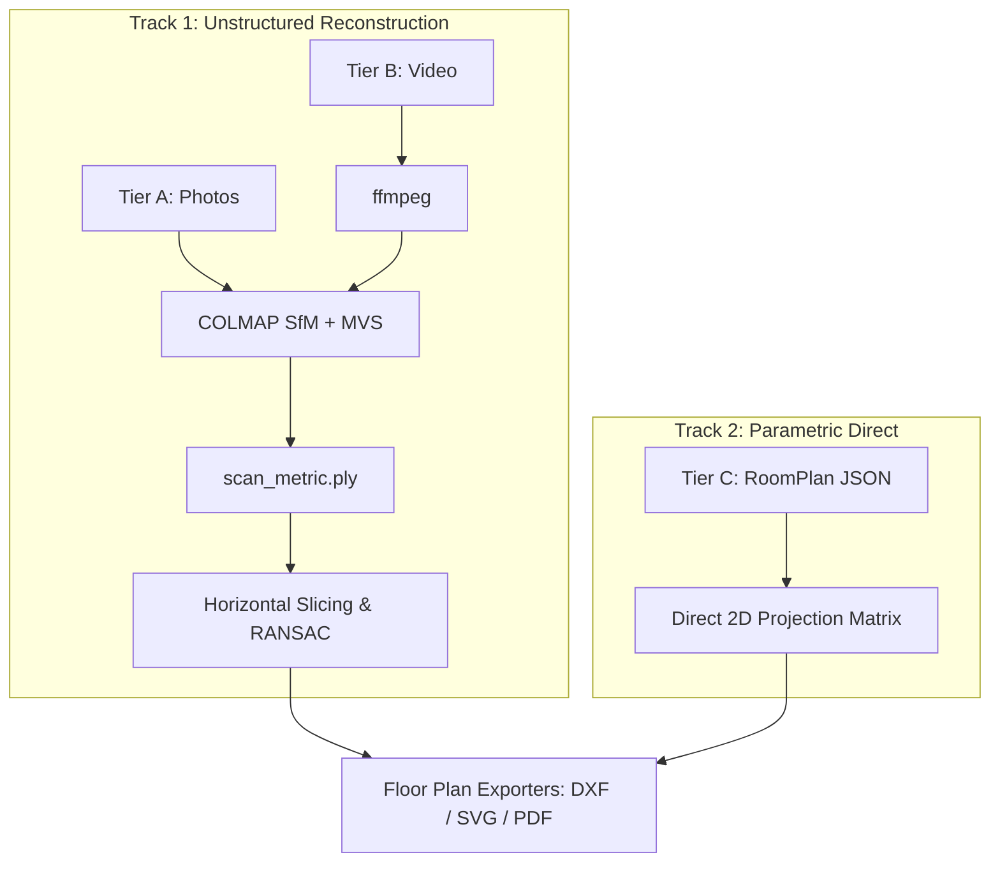

# Architectural Nuances & Alternative Pipeline Options

## 1. Executive Summary & Ultimate Goal

### Ultimate Goal of the Project
The primary objective of this project is to take accessible mobile phone captures—across three distinct hardware and capture modalities—and automatically generate **accurate, dimensioned 2D floor plans** (DXF, SVG, PDF) alongside a **metric 3D digital twin** (PLY, OBJ, GLTF).

The three capture tiers are:
1. **Tier A (Photos)**: 20–50 overlapping 2D still images captured with any smartphone.
2. **Tier B (Video)**: Continuous handheld video walkthrough of a space (extracted into frames via `ffmpeg`).
3. **Tier C (LiDAR)**: Metric depth and scene capture using LiDAR-equipped mobile devices (e.g., Apple iPhone Pro / iPad Pro with ARKit / RoomPlan).

---

## 2. The Current Architecture & Its Nuance

### Current Baseline Flow
Currently, the codebase enforces a strict **Unified Point-Cloud Bottleneck**:

```
Tier A (Photos) ──> COLMAP (SfM + MVS) ──> [Scale Anchoring] ──┐
                                                               │
Tier B (Video)  ──> ffmpeg ──> COLMAP ───> [Scale Anchoring] ──┼──> scan_metric.ply ──> common_backend.py ──> 2D Slicing + RANSAC ──> DXF / SVG
                                                               │
Tier C (LiDAR)  ──> RoomPlan JSON ───────> [_sample_wall()] ───┘
```

### The Architectural Nuance / Friction Point
In [`tier_c.py`](file:///Users/aadarshkt/Desktop/3DReconstruction/backend/app/pipeline/tier_c.py), when processing a RoomPlan export:
* Apple RoomPlan outputs a structured `CapturedRoom` JSON.
* This JSON **already provides** pre-segmented, classified, metric architectural elements:
  * Exact wall centerlines, thickness, length, and height.
  * 3D transform matrices (position and rotation in meters).
  * Door and window bounding boxes, openings, and parent-wall relations.
  * Classified furniture objects (tables, chairs, storage, etc.).

**The Paradox:**
The current pipeline parses this clean, parametric vector JSON, samples thousands of artificial 3D points on the wall surfaces ([`_sample_wall()`](file:///Users/aadarshkt/Desktop/3DReconstruction/backend/app/pipeline/tier_c.py#L117)), saves a `.ply`, and then hands it off to [`common_backend.py`](file:///Users/aadarshkt/Desktop/3DReconstruction/backend/app/pipeline/common_backend.py). The common backend then slices the points, runs RANSAC/Hough transforms to rediscover the wall lines, and attempts to re-close corners that were already perfectly closed in the JSON.

### Trade-offs of the Current Design
* **Advantages**:
  * Single, unified entry point (`scan_metric.ply`) for all tiers.
  * Downstream pipeline code only needs to know how to process a point cloud.
* **Disadvantages**:
  * **Loss of Ground-Truth Precision**: Converts exact analytic line equations into noisy point clusters, resulting in rounded or misaligned corners after RANSAC.
  * **Loss of Semantic Richness**: Destroys semantic tags (`is_door`, `is_window`, `is_opening`, `furniture_type`) that must later be guessed or omitted.
  * **Compute Waste**: Point synthesis and subsequent RANSAC line fitting add unnecessary CPU cycles.

---

## 3. Alternative Architectural Paths

To achieve the ultimate goal with maximum accuracy, performance, and maintainability, several architectural options can be explored:

---

### Option 1: The Unified Point-Cloud Bottleneck (Current Architecture)
* **Concept**: All inputs are strictly normalized into an unorganized metric 3D point cloud (`scan_metric.ply`). Downstream 2D floor plans are always extracted via horizontal point-cloud cross-sectioning (1.0m–1.5m height) and RANSAC line detection.
* **Best suited for**: Fast MVP proof-of-concept where minimizing the number of pipeline branches is prioritized over Tier C perfection.
* **Drawback**: Sub-optimal for RoomPlan data; high vulnerability to clutter, furniture occlusion, and statistical line-fitting errors.

---

### Option 2: Dual-Track Pipeline (Bypass for Parametric Inputs)
* **Concept**: Split the 2D generation into two specialized tracks based on input type:
  * **Track 1 (Sensory / Unstructured)**: Tiers A & B (Photos/Video) $\to$ COLMAP $\to$ Point Cloud $\to$ Slicing $\to$ RANSAC $\to$ 2D Vector Plan.
  * **Track 2 (Parametric / Structured)**: Tier C (RoomPlan JSON) $\to$ Direct 2D Projection ($x, z$) $\to$ Snap-to-Grid / Corner Reconciliation $\to$ Direct DXF/SVG.



* **Advantages**:
  * Preserves 100% of RoomPlan precision (millimeter accuracy).
  * Instantaneous 2D plan generation for Tier C (< 1 second).
  * Directly draws authentic door swings, window symbols, and room dimensions using native RoomPlan attributes.
* **Disadvantages**:
  * Two separate generators to maintain for the 2D export.

---

### Option 3: Unified Parametric Schema (Domain-Driven IR) — *Recommended*
* **Concept**: Instead of using a **point cloud** as the intermediate representation (IR), use a **Parametric Architectural Model (`FloorPlanModel`)** as the unified IR.

```
Tier A/B (Photos/Video) ──> COLMAP ──> Point Cloud ──> Wall Detector ──┐
                                                                         ▼
                                                                [FloorPlanModel (IR)]
                                                                • walls: List[Wall]
                                                                • doors: List[Door]
                                                                • windows: List[Window]
                                                                • rooms: List[Room]
                                                                         │
Tier C (RoomPlan JSON)  ──> Direct JSON Parser / Mapper ─────────────────┘
                                                                         │
                                                                         ▼
                                                          [Unified Vector Exporters]
                                                          • DXF Exporter (ezdxf)
                                                          • SVG Exporter (svgwrite)
                                                          • PDF Exporter (reportlab)
```

* **How it works**:
  1. Define a standardized schema (e.g. Pydantic models):
     * `Wall(start: Point2D, end: Point2D, thickness: float, height: float)`
     * `Door(position: Point2D, width: float, swing_direction: str)`
     * `Window(position: Point2D, width: float)`
     * `Room(name: str, polygon: Polygon, area_sqm: float)`
  2. **Tier C Parser**: Directly maps RoomPlan JSON objects to `FloorPlanModel` (trivial $O(1)$ mapping).
  3. **Tier A/B Extractor**: Runs COLMAP $\to$ Point Cloud $\to$ Slicing/RANSAC $\to$ outputs the exact same `FloorPlanModel`.
  4. **Exporters**: The DXF, SVG, and PDF renderers only consume `FloorPlanModel`.
* **Advantages**:
  * **Clean decoupling**: Exporters don't care how the geometry was obtained.
  * Retains full semantic fidelity for Tier C, while elevating Tier A/B to the same structured standard.
  * Standardizes validation, measurement calculations, area square-footage computations, and CAD styling across all inputs.

---

### Option 4: Hybrid / Multi-Modal Fusion (Future Horizon)
* **Concept**: Leveraging simultaneous sensor streams when available (e.g., iPhone capturing both video frames and ARKit depth buffers simultaneously).
* **Workflow**:
  * Uses RoomPlan geometry for macro structure (walls, ceilings, floor boundaries).
  * Uses photo/video photogrammetry or Neural Radiance Fields / 3D Gaussian Splatting (3DGS) for high-fidelity surface textures, damage identification, and visual inspection.
* **Advantages**: Best of both worlds: CAD-grade architectural accuracy for 2D plans + photorealistic textured 3D digital twins.

---

## 4. Comparison Matrix of Options

| Dimension | Option 1: Point Cloud Bottleneck (Current) | Option 2: Dual-Track (Direct Bypass) | Option 3: Unified Parametric Schema (Recommended) |
| :--- | :--- | :--- | :--- |
| **Tier C 2D Accuracy** | Moderate (RANSAC introduces noise) | Maximum (Exact vector math) | Maximum (Exact vector math) |
| **Tier A/B 2D Accuracy** | Moderate (Dependent on reference scale) | Moderate (Dependent on reference scale) | Moderate (Dependent on reference scale) |
| **Door / Window Semantics** | Lost (treated as wall gaps) | Preserved | Preserved across all tiers |
| **Processing Speed (Tier C)** | Slow (~15–30s for sampling & fitting) | Fast (< 0.5s) | Fast (< 0.5s) |
| **Code Modularity** | High (single pipeline) | Medium (branched pipeline) | Very High (domain-driven IR) |
| **Extensibility (e.g. BIM/IFC)** | Difficult | Moderate | Native / Easy |

---

## 5. Strategic Recommendations

1. **Short-Term (Quick Win)**:
   * Keep the point cloud for 3D visualization needs (`mesh.obj`, `scan_metric.ply`).
   * For RoomPlan uploads (`.json`), bypass the point-cloud slicing step and generate the 2D DXF/SVG directly from the JSON coordinates.
2. **Medium-Term (Target Architecture)**:
   * Formalize the `FloorPlanModel` Pydantic schema as the canonical representation for all 2D outputs.
   * Refactor [`common_backend.py`](file:///Users/aadarshkt/Desktop/3DReconstruction/backend/app/pipeline/common_backend.py) to output `FloorPlanModel` from point clouds, and let downstream format writers (DXF, SVG, PDF) only depend on that model.
3. **Accuracy Verification**:
   * Benchmark both paths against physical tape-measured ground truth to quantify the error reduction when bypassing RANSAC on LiDAR data.
