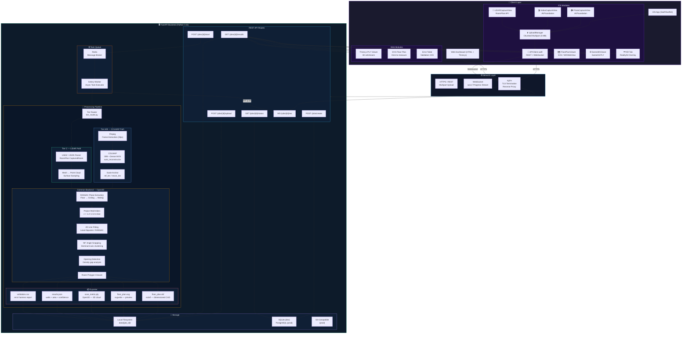
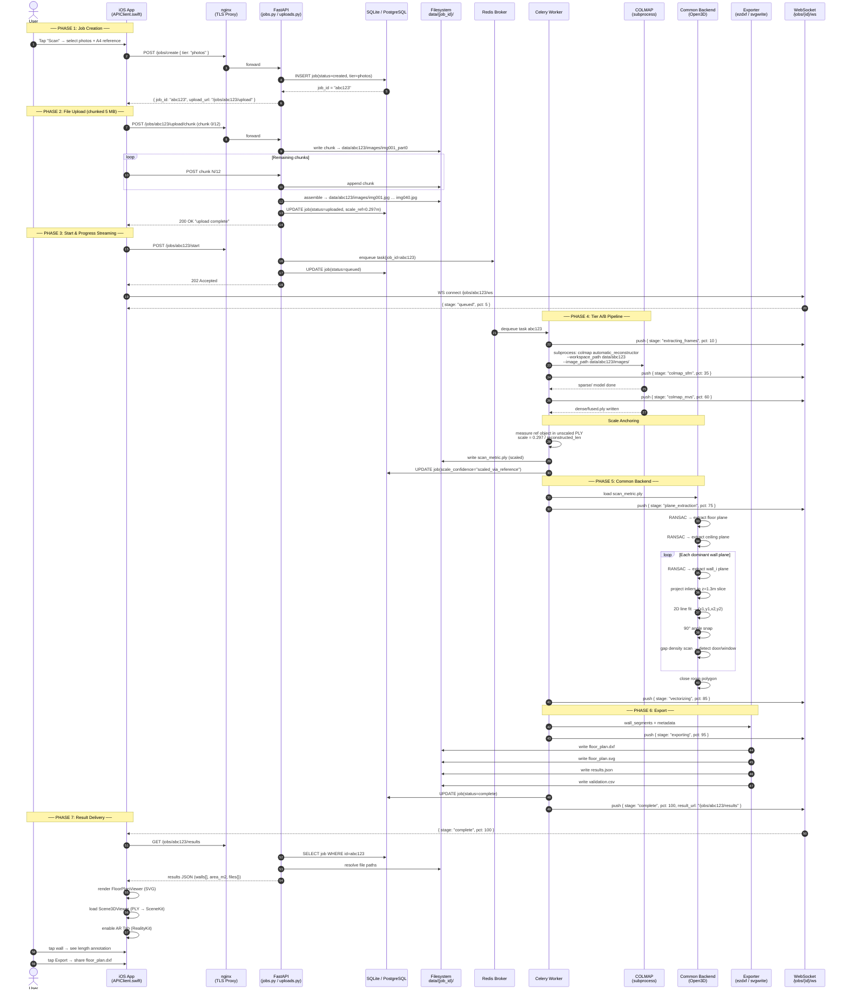

# 3D Reconstruction System — Architecture & Request Lifecycle

## System Architecture

---

## Single Request Lifecycle — Photo Tier (Tier A) End-to-End

---

## Component Inventory

| # | Component | Technology | Role |
|---|-----------|-----------|------|
| 1 | **PhotoCaptureView** | Swift / AVFoundation | Capture overlapping photos |
| 2 | **VideoCaptureView** | Swift / AVFoundation | Record walkthrough video |
| 3 | **LiDARCaptureView** | Swift / RoomPlan API | Native metric scan on LiDAR devices |
| 4 | **UploadManager** | URLSession / Multipart | Chunked 5 MB upload with retry |
| 5 | **APIClient** | Swift async/await + URLSessionWebSocketTask | REST calls + WebSocket progress stream |
| 6 | **nginx** | nginx | TLS termination, reverse proxy |
| 7 | **FastAPI** | Python 3.11 / uvicorn | REST API, job orchestration |
| 8 | **SQLite / PostgreSQL** | SQLAlchemy ORM | Job state, metadata |
| 9 | **Redis** | Redis | Celery message broker |
| 10 | **Celery Worker** | Celery | Async pipeline execution |
| 11 | **Tier Router** | `tier_router.py` | Dispatch to A/B or C path |
| 12 | **ffmpeg** | CLI subprocess | Frame extraction from video |
| 13 | **COLMAP** | CLI subprocess | SfM sparse + MVS dense reconstruction |
| 14 | **Scale Anchor** | NumPy | Derive metric scale from reference object |
| 15 | **USDZ/JSON Parser** | `tier_c.py` | Decode RoomPlan export to point cloud |
| 16 | **RANSAC Extractor** | Open3D | Segment floor, ceiling, wall planes |
| 17 | **Wall Vectorizer** | `vectorizer.py` | Project inliers → 2D line segments |
| 18 | **90° Snapper** | NumPy | Orthogonality correction heuristic |
| 19 | **Opening Detector** | `common_backend.py` | Gap density → door / window labels |
| 20 | **Exporter** | ezdxf, svgwrite | DXF + SVG + JSON + CSV output |
| 21 | **WebSocket Push** | FastAPI WebSocket | Real-time pipeline progress (0–100%) |
| 22 | **FloorPlanViewer** | WKWebView / SVGKit | SVG floor plan with tap-to-measure |
| 23 | **Scene3DViewer** | SceneKit | PLY point cloud 3D orbit/zoom |
| 24 | **AR Overlay** | RealityKit | Place floor plan in physical space |
| 25 | **Web Dashboard** | Three.js + Vanilla JS | Browser-based 3D + SVG viewer |

---

## Data Flow Summary

```mermaid
flowchart LR
    A["📷 Photos / 🎬 Video / 📡 LiDAR"]
    B["Metric Point Cloud\nscan_metric.ply"]
    C["Structural Elements\nfloor · ceiling · walls[]"]
    D["2D Wall Segments\n(x1,y1)→(x2,y2) + openings"]
    E["Outputs\nDXF · SVG · PLY · JSON · CSV"]

    A -->|"Tier A/B: COLMAP + scale\nTier C: USDZ parse"| B
    B -->|"RANSAC plane extraction"| C
    C -->|"Project + line-fit + snap"| D
    D -->|"ezdxf / svgwrite"| E

    style A fill:#7c3aed,color:#fff,stroke:#7c3aed
    style B fill:#0ea5e9,color:#fff,stroke:#0ea5e9
    style C fill:#10b981,color:#fff,stroke:#10b981
    style D fill:#f59e0b,color:#fff,stroke:#f59e0b
    style E fill:#fb7185,color:#fff,stroke:#fb7185
```

---

## Accuracy & Confidence Matrix

| Tier | Input | Scale Source | Expected Wall Error | Confidence Flag |
|------|-------|-------------|--------------------|----|
| **A — Photos** | 25–40 JPEG | Reference object (A4/door) | ≤ 5 cm | `scaled_via_reference` |
| **B — Video** | frames @ 3 fps | Reference object | ≤ 7 cm | `scaled_via_reference` |
| **C — LiDAR** | USDZ / RoomPlan JSON | Native metric | ≤ 3 cm | `native_metric` |
| **A+C Fusion** | Photos + USDZ | ICP alignment | ≤ 3 cm | `fusion_icp` |
