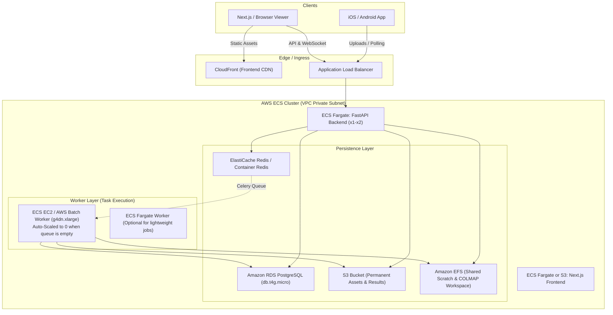

# AWS Containerized Deployment Plan: 3D Reconstruction & Floor Plan System

## 1. Architecture Overview & Workload Analysis

This repository contains a multi-tier spatial computing and 3D reconstruction system:
1. **FastAPI Backend (`api`)**: REST API for job dispatch, RoomPlan/LiDAR ingestion, LLM claim orchestration, and static viewer hosting.
2. **Celery Worker (`worker`)**: Heavy CPU/GPU compute running:
   - **COLMAP**: Structure-from-Motion (feature extraction, matcher, bundle adjustment) + Dense MVS (`patch_match_stereo`, stereo fusion).
   - **Open3D / RANSAC**: Point cloud cleaning, plane segmentation, wall projection, 2D vector generation.
   - **ReportLab**: PDF report and insurance claim analysis.
3. **Database**: PostgreSQL (SQLAlchemy async/sync models for jobs, rooms, measurements, claims).
4. **Broker / Queue**: Redis (Celery broker and task result backend).
5. **Frontend**: Next.js 16 (React 19 + Three.js 3D viewer) and static `web_dashboard`.
6. **Shared Storage**: `/app/data` holding raw uploads, COLMAP databases, dense stereo caches, point clouds (`.ply`), and meshes (`.glb`).



---

## 2. GPU Acceleration on AWS: Technical & Financial Analysis

### Why GPU is Critical for COLMAP
- **Sparse Reconstruction (SfM)**: Feature extraction (`SiftGPU`) and matching run **5x to 15x faster** on NVIDIA GPUs than CPU multithreading.
- **Dense Stereo (MVS)**: COLMAP's `patch_match_stereo` **natively requires an NVIDIA CUDA GPU** (Compute Capability $\ge 3.0$). Running dense MVS without CUDA requires either custom CPU forks or skipping dense stereo and relying on sparse cloud meshing (Poisson surface reconstruction on sparse points), which produces significantly lower quality walls and meshes.
- **Processing Time Comparison** (for ~60 high-res photos):
  - **CPU-only (4 vCPU)**: 25 – 45 minutes (high risk of timeout or memory exhaustion).
  - **NVIDIA T4 GPU (g4dn.xlarge)**: 3 – 6 minutes.

### GPU Instance Selection on AWS
| Instance Type | GPU | VRAM | vCPU | RAM | On-Demand ($/hr) | Spot Price ($/hr) | Suitability |
| :--- | :--- | :--- | :--- | :--- | :--- | :--- | :--- |
| **`g4dn.xlarge`** *(Recommended)* | 1x NVIDIA T4 | 16 GB | 4 | 16 GB | **$0.526** | **~$0.158** (70% off) | **Optimal balance of price, CUDA 7.5, and 16GB VRAM.** |
| **`g5.xlarge`** | 1x NVIDIA A10G | 24 GB | 4 | 16 GB | $1.006 | ~$0.402 | Best for larger NeRF/Gaussian Splatting pipelines. |
| **`p3.2xlarge`** | 1x NVIDIA V100 | 16 GB | 8 | 61 GB | $3.06 | ~$0.918 | Overkill and unnecessary cost for standard COLMAP. |

### The "Scale-to-Zero" Pattern (Avoid the $380/mo idle GPU trap)
- If you run a `g4dn.xlarge` 24/7 on-demand: $0.526 \times 730\text{ hrs} = \mathbf{\$384/\text{month}}$ **even if nobody uses it**.
- **The Solution for a "Couple of Users"**:
  1. FastAPI runs on lightweight serverless containers (ECS Fargate) for pennies.
  2. Celery Worker runs in an ECS EC2 Auto-Scaling Group (ASG) or AWS Batch backed by `g4dn.xlarge` (with Spot Instances enabled).
  3. **Auto-Scaling Metric**: Scale based on Celery Queue length (tracked via Redis queue depth CloudWatch metric).
     - When queue is 0: Desired instances = 0 (**$0.00/hr**).
     - When a user uploads a reconstruction job: ASG launches a Spot `g4dn.xlarge` in ~90 seconds.
     - The job executes (3–5 min), results are uploaded to S3, and after 10 minutes of inactivity, the instance terminates.
  4. **Cost per reconstruction job**: $\approx \mathbf{\$0.02 - \$0.04}$ per job!

---

## 3. Storage Architecture: S3 vs EFS

COLMAP makes thousands of random read/writes to local files (`db.db`, workspace image pairs, depth maps). Running COLMAP directly over S3 APIs causes extreme latency and failure.

| Storage | Role | Configuration |
| :--- | :--- | :--- |
| **Amazon EFS (Elastic File System)** | High-throughput shared workspace mounted at `/app/data` across both API and Celery Worker containers. | General Purpose, One Zone (lower cost), provisioned with Lifecycle policy to transition cold files to EFS Infrequent Access (IA). |
| **Amazon S3** | Durable storage for final artifacts (point cloud `.ply`, textured `.glb`, 2D floor plan `.svg`/`.png`, PDF reports, original video archives). | Standard storage with automated pre-signed URLs for client downloads. |

---

## 4. Cost Estimates for a "Couple of Users"

Assuming **2 to 5 active users** generating approximately **20 to 50 3D reconstruction jobs per month**:

### Option A: Lean Serverless Architecture (Scale-to-Zero GPU Worker) — *Recommended*
*ECS Fargate for API + Scale-to-Zero Spot `g4dn.xlarge` for Worker + RDS PostgreSQL + Containerized Redis on Fargate.*

| Component | Sizing / Tier | Monthly Cost (USD) |
| :--- | :--- | :--- |
| **ECS Fargate (FastAPI)** | 0.5 vCPU, 1 GB RAM (running 24/7) | ~$11.00 |
| **ECS Fargate (Redis)** | 0.25 vCPU, 0.5 GB RAM (runs lightweight broker) | ~$5.50 |
| **Amazon RDS PostgreSQL** | `db.t4g.micro` (2 vCPU burstable, 1 GB RAM, 20 GB gp3 storage) | ~$14.00 |
| **Application Load Balancer** | 1 ALB (shared between API and Frontend) | ~$18.00 |
| **Amazon EFS** | 20 GB General Purpose (scratch workspace) | ~$6.00 |
| **Amazon S3 & Data Transfer** | 50 GB storage + bandwidth | ~$2.50 |
| **Worker GPU Compute (`g4dn.xlarge`)** | 50 jobs/month $\times$ 6 min = 5 hours total @ Spot ($0.16/hr) | **~$0.80** |
| **AWS CloudWatch & Logs** | Basic metrics & log retention (7 days) | ~$2.00 |
| **Estimated Total Monthly Cost** | | **~$59.80 / month** |

> [!TIP]
> **Ultra-Lean Alternative (Single EC2 Instance for Dev/Staging)**:
> If budget is tight during early testing, running all containers (`docker-compose.yml`) on a single **`t4g.large` (CPU-only, $48/mo)** or a **`g4dn.xlarge` that you stop automatically at night ($0.526/hr $\times$ 4 hrs/day = ~$63/mo)** eliminates the ALB and RDS overhead, bringing monthly costs down to **~$30 – $65/month**.

---

## 5. Terraform (IaC) Directory Structure

A modular, clean Terraform architecture separating networking, data persistence, and container compute:

```
terraform/
├── environments/
│   ├── dev/
│   │   ├── main.tf
│   │   ├── variables.tf
│   │   └── terraform.tfvars
│   └── prod/
│       ├── main.tf
│       ├── variables.tf
│       └── terraform.tfvars
└── modules/
    ├── vpc/                     # VPC, public/private subnets, NAT Gateway
    ├── security/                # Security Groups & IAM roles (ECS Task Execution, S3/EFS policies)
    ├── storage/                 # S3 buckets & EFS file system
    ├── database/                # RDS PostgreSQL (db.t4g.micro)
    ├── ecr/                     # Container registries for API, Worker, and Frontend
    ├── ecs_cluster/             # ECS Cluster, Capacity Providers, Fargate & EC2 ASG
    ├── ecs_services/            # Task definitions and services for API & Redis
    ├── worker_asg/              # g4dn.xlarge Launch Template, Auto Scaling Group & Scaling Policies
    └── alb/                     # ALB, Target Groups, HTTPS listener, Route53 records
```

---

## 6. Key Terraform Script Blueprints

### A. EFS File System for Container Shared Storage (`modules/storage/efs.tf`)
```hcl
resource "aws_efs_file_system" "pipeline_storage" {
  creation_token   = "${var.environment}-floorplan-data"
  performance_mode = "generalPurpose"
  throughput_mode  = "bursting"
  encrypted        = true

  lifecycle_policy {
    transition_to_ia = "AFTER_30_DAYS"
  }

  tags = {
    Name        = "${var.environment}-floorplan-efs"
    Environment = var.environment
  }
}

resource "aws_efs_mount_target" "efs_targets" {
  count           = length(var.private_subnet_ids)
  file_system_id  = aws_efs_file_system.pipeline_storage.id
  subnet_id       = var.private_subnet_ids[count.index]
  security_groups = [var.efs_security_group_id]
}

resource "aws_efs_access_point" "app_data" {
  file_system_id = aws_efs_file_system.pipeline_storage.id

  posix_user {
    gid = 1000
    uid = 1000
  }

  root_directory {
    path = "/data"
    creation_info {
      owner_gid   = 1000
      owner_uid   = 1000
      permissions = "755"
    }
  }
}
```

### B. GPU Worker EC2 Launch Template & Auto Scaling (`modules/worker_asg/main.tf`)
```hcl
# User data to join ECS cluster and configure NVIDIA GPU runtime
locals {
  user_data = <<-EOF
              #!/bin/bash
              echo "ECS_CLUSTER=${var.ecs_cluster_name}" >> /etc/ecs/ecs.config
              echo "ECS_ENABLE_GPU_SUPPORT=true" >> /etc/ecs/ecs.config
              EOF
}

resource "aws_launch_template" "gpu_worker" {
  name_prefix   = "${var.environment}-gpu-worker-"
  image_id      = var.ecs_gpu_optimized_ami_id  # Recommended: amzn2-ami-ecs-gpu-hvm
  instance_type = "g4dn.xlarge"

  iam_instance_profile {
    name = var.ecs_instance_profile_name
  }

  network_interfaces {
    associate_public_ip_address = false
    security_groups             = [var.worker_security_group_id]
  }

  user_data = base64encode(locals.user_data)

  instance_market_options {
    market_type = "spot"
    spot_options {
      max_price = "0.25"  # Cap spot bid
    }
  }

  tag_specifications {
    resource_type = "instance"
    tags = {
      Name = "${var.environment}-ecs-gpu-worker"
    }
  }
}

resource "aws_autoscaling_group" "gpu_worker_asg" {
  name_prefix         = "${var.environment}-gpu-asg-"
  vpc_zone_identifier = var.private_subnet_ids
  min_size            = 0
  max_size            = 2
  desired_capacity    = 0  # Scales to zero when idle

  launch_template {
    id      = aws_launch_template.gpu_worker.id
    version = "$Latest"
  }

  tag {
    key                 = "AmazonECSManaged"
    value               = true
    propagate_at_launch = true
  }
}
```

### C. ECS Task Definition with GPU Resource Requirement (`modules/worker_asg/task_def.tf`)
```hcl
resource "aws_ecs_task_definition" "celery_gpu_worker" {
  family                   = "${var.environment}-celery-gpu-worker"
  requires_compatibilities = ["EC2"]
  network_mode             = "awsvpc"
  memory                   = "14000"
  cpu                      = "3800"
  execution_role_arn       = var.ecs_execution_role_arn
  task_role_arn            = var.ecs_task_role_arn

  volume {
    name = "efs-data"
    efs_volume_configuration {
      file_system_id     = var.efs_file_system_id
      transit_encryption = "ENABLED"
      authorization_config {
        access_point_id = var.efs_access_point_id
        iam             = "ENABLED"
      }
    }
  }

  container_definitions = jsonencode([
    {
      name      = "celery-worker"
      image     = "${var.worker_ecr_url}:latest"
      essential = true
      command   = ["celery", "-A", "app.tasks.celery_tasks", "worker", "--loglevel=info", "--concurrency=1"]

      resourceRequirements = [
        {
          type  = "GPU"
          value = "1"
        }
      ]

      environment = [
        { name = "DATABASE_URL", value = var.database_url },
        { name = "DATABASE_SYNC_URL", value = var.database_sync_url },
        { name = "REDIS_URL", value = var.redis_url },
        { name = "CELERY_BROKER_URL", value = var.redis_url },
        { name = "DATA_DIR", value = "/app/data" },
        { name = "COLMAP_USE_GPU", value = "1" }
      ]

      mountPoints = [
        {
          sourceVolume  = "efs-data"
          containerPath = "/app/data"
          readOnly      = false
        }
      ]

      logConfiguration = {
        logDriver = "awslogs"
        options = {
          "awslogs-group"         = "/ecs/${var.environment}/celery-worker"
          "awslogs-region"        = var.aws_region
          "awslogs-stream-prefix" = "worker"
        }
      }
    }
  ])
}
```

---

## 7. Container Images Refactoring Needed

To deploy cleanly on AWS:
1. **GPU-enabled Dockerfile for Worker**:
   Base image should be `nvidia/cuda:12.2.2-runtime-ubuntu22.04` with COLMAP compiled with CUDA support:
   ```dockerfile
   FROM nvidia/cuda:12.2.2-devel-ubuntu22.04 AS builder
   # Install COLMAP with CUDA enabled
   ...
   ```
2. **FastAPI Backend Dockerfile**:
   Can remain a lightweight Python 3.11/3.12 slim image (no GPU needed for API endpoints).
3. **Frontend Dockerfile**:
   Next.js standalone build:
   ```dockerfile
   FROM node:20-alpine AS runner
   WORKDIR /app
   COPY --from=builder /app/.next/standalone ./
   COPY --from=builder /app/.next/static ./.next/static
   CMD ["node", "server.js"]
   ```

---

## 8. Rollout Phases

1. **Phase 1: Container Hardening**:
   - Split Dockerfiles into `Dockerfile.api`, `Dockerfile.worker` (CPU and GPU flavors), and `Dockerfile.web`.
   - Update `app/config.py` to allow S3 presigned URL generation for results.
2. **Phase 2: Terraform Baseline**:
   - Provision VPC, Subnets, Security Groups, ECR, S3, and EFS.
   - Deploy RDS PostgreSQL `db.t4g.micro` and Redis.
3. **Phase 3: ECS Deployments**:
   - Deploy FastAPI to Fargate behind ALB.
   - Configure GPU Worker ASG on EC2 Spot (`g4dn.xlarge`) with Scale-to-Zero CloudWatch alarm on Redis queue depth.
4. **Phase 4: Smoke Test & Validation**:
   - Submit sample dataset via API -> verify GPU worker spin-up -> confirm 3D reconstruction completion in <6 min -> verify automated termination.
