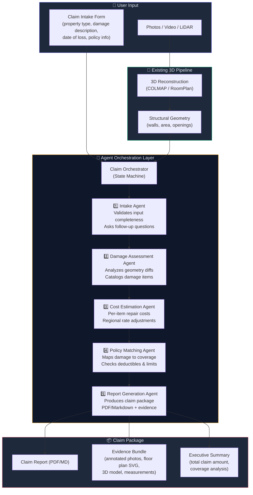

# Insurance Claim Agent Orchestration for Physical Property

Add an AI agent orchestration layer on top of the existing 3D reconstruction pipeline to automate and simplify insurance claims for physical property damage (homes, offices, warehouses, retail spaces, etc.).

## Background & Problem

Today, filing a physical-property insurance claim is a painful manual process:
1. The policyholder must photograph or video every damaged area.
2. They must manually inventory damage, estimate repair costs, cross-reference their policy.
3. They fill out long, jargon-heavy forms and wait weeks for an adjuster.

This project already has the hard part solved — **a working 3D reconstruction pipeline** that turns phone-captured photos/video/LiDAR into dimensioned floor plans with wall geometry, openings, and room areas. The missing piece is an **intelligent agent layer** that orchestrates the pipeline output + LLM reasoning + external data to produce a complete, submission-ready insurance claim package.

## User Review Required

> [!IMPORTANT]
> **LLM Provider**: The `.env` already has OpenRouter credentials (`LLM_BASE_URL`, `LLM_API_KEY`, `LLM_MODEL`). This plan uses those via an OpenAI-compatible client. If you prefer a different provider (Gemini API, Anthropic direct, etc.), let me know.

> [!IMPORTANT]
> **Scope Check**: This plan builds the full agent backend + extends the web dashboard with a "Claim Assistant" tab. It does **not** modify the iOS app. iOS integration can follow as a Phase 2. Confirm if this is acceptable.

> [!WARNING]
> **No Vision Model Yet**: The frame-level damage detection (spotting cracks, water stains, etc. in captured images) requires a vision-capable LLM or a fine-tuned detector. Phase 1 uses the LLM with text descriptions + structural data from the 3D pipeline. Phase 2 adds a vision model pass over the raw frames. Confirm if this phased approach works.

## Open Questions

1. **Policy Document Parsing**: Should the agent accept uploaded PDF/image policy documents and extract coverage details (deductibles, limits, covered perils)? This adds OCR + document parsing complexity. Alternatively, the user can manually enter coverage info via a simple form.

2. **Damage Categories**: The plan covers structural damage to walls, floors, roofs, and openings. Should it also handle contents damage (furniture, electronics, personal items)? That would require a separate inventory sub-agent.

3. **Cost Estimation Data**: For repair cost estimates, should I integrate a public cost database (e.g., RSMeans-style per-sqft rates), or should the LLM produce ballpark estimates based on its training data?

4. **Multi-Room Support**: The current pipeline processes one room at a time. Should the claim agent support orchestrating multiple jobs (one per room) into a single unified claim report?

---

## Proposed Changes

The architecture introduces a **Claim Orchestrator** — a multi-step agent that coordinates several specialist sub-agents, each responsible for one phase of the claim process. All sub-agents share a common state object (`ClaimContext`) that flows through the pipeline.

### Workflow Overview



---

### Component 1: Claim Data Model & Configuration

New models and config for the claim system.

#### [MODIFY] [config.py](file:///Users/aadarshkt/Desktop/3DReconstruction/backend/app/config.py)
- Add LLM settings to the `Settings` class: `LLM_BASE_URL`, `LLM_API_KEY`, `LLM_MODEL`, `LLM_TIMEOUT_S`, `LLM_MAX_TOKENS` (these already exist in `.env` but aren't read by the Python config).

#### [NEW] `backend/app/models/claim.py`
- `ClaimStatus` enum: `intake`, `reconstructing`, `assessing_damage`, `estimating_costs`, `matching_policy`, `generating_report`, `complete`, `failed`
- `Claim` SQLAlchemy model:
  - `id` (UUID), `job_id` (FK to Job), `status`, `created_at`, `updated_at`
  - `property_type` (residential/commercial/industrial)
  - `damage_description` (user's free-text description)
  - `date_of_loss` (when damage occurred)
  - `cause_of_loss` (fire/water/storm/vandalism/other)
  - `policy_number`, `insurer_name` (optional)
  - `deductible_amount`, `coverage_limit` (optional)
  - `claim_payload` (JSONB — full structured claim data built by agents)
  - `report_path` (path to generated report file)
  - `total_estimated_cost` (float — sum of all repair cost estimates)

#### [NEW] `backend/app/agents/claim_context.py`
- `ClaimContext` dataclass — the shared state object passed through all agents:
  ```python
  @dataclass
  class ClaimContext:
      claim_id: str
      job_id: str
      property_type: str
      damage_description: str
      date_of_loss: str
      cause_of_loss: str
      # From 3D pipeline
      room_area_m2: float
      walls: list[dict]       # wall geometry from results.json
      wall_count: int
      scale_confidence: str
      # Built by agents
      damage_items: list[DamageItem]       # from Damage Agent
      cost_estimates: list[CostEstimate]   # from Cost Agent
      policy_analysis: PolicyAnalysis      # from Policy Agent
      report_path: str                     # from Report Agent
  ```

---

### Component 2: LLM Client

A thin wrapper around the OpenAI-compatible API configured in `.env`.

#### [NEW] `backend/app/agents/llm_client.py`
- `LLMClient` class that:
  - Uses `httpx` (async) to call the OpenRouter/OpenAI-compatible chat completions endpoint
  - Accepts a system prompt + user messages
  - Supports structured output via JSON mode
  - Has retry logic with exponential backoff
  - Respects `LLM_TIMEOUT_S` and `LLM_MAX_TOKENS` from config
  - Provides a sync wrapper for use inside Celery tasks

---

### Component 3: Agent Implementations

Each agent is a Python class with a `run(context: ClaimContext) -> ClaimContext` method. Agents are pure functions over the claim context — they read what they need, call the LLM, and enrich the context.

#### [NEW] `backend/app/agents/__init__.py`

#### [NEW] `backend/app/agents/intake_agent.py`
**Purpose**: Validate that the user has provided enough information to proceed. If not, return a list of follow-up questions.
- Checks: photos uploaded? damage description provided? date of loss set? property type selected?
- Uses LLM to assess if the damage description is specific enough (e.g., "there's damage" is too vague; "water damage to north-facing wall, approx 2m × 1m area, drywall bubbling" is actionable).
- Output: `context.intake_complete = True` or `context.follow_up_questions = [...]`

#### [NEW] `backend/app/agents/damage_agent.py`
**Purpose**: Analyze the 3D pipeline output + user description to produce a structured damage inventory.
- Reads `context.walls`, `context.room_area_m2`, `context.damage_description`
- Sends wall geometry + user description to LLM with a prompt like:
  > "Given the following room with {N} walls totaling {X} m² and the user's damage description: '{desc}', produce a structured damage inventory. For each damaged element, specify: item name, affected area (m²), severity (minor/moderate/severe), damage type, and whether repair or replacement is needed."
- Output: `context.damage_items = [DamageItem(...), ...]`

#### [NEW] `backend/app/agents/cost_agent.py`
**Purpose**: Estimate repair/replacement costs for each damage item.
- Takes each `DamageItem` and produces a `CostEstimate` with:
  - `item_name`, `repair_type` (repair/replace), `unit_cost_per_m2`, `total_area_m2`, `material_cost`, `labor_cost`, `total_cost`
- Uses LLM with embedded rate tables in the system prompt (per-sqft costs for common repairs: drywall, painting, flooring, roofing, windows, doors, plumbing, electrical).
- Output: `context.cost_estimates = [CostEstimate(...), ...]`

#### [NEW] `backend/app/agents/policy_agent.py`
**Purpose**: Match damage items against policy coverage and flag exclusions.
- If the user provided policy details (coverage limit, deductible, covered perils), checks whether:
  - The cause of loss is a covered peril
  - Total estimated cost exceeds deductible (i.e., claim is worth filing)
  - Total exceeds coverage limit (partial recovery)
- Output: `context.policy_analysis = PolicyAnalysis(covered=True, deductible=X, out_of_pocket=Y, ...)` or sensible defaults if no policy info was provided.

#### [NEW] `backend/app/agents/report_agent.py`
**Purpose**: Generate a comprehensive, human-readable claim report.
- Assembles all context into a structured Markdown document:
  - **Header**: Claim ID, date, property info
  - **Executive Summary**: Total claimed amount, coverage status
  - **Room Analysis**: Floor plan SVG embed, room area, wall measurements
  - **Damage Inventory**: Table of all damage items with severity, photos
  - **Cost Breakdown**: Itemized repair costs with subtotals
  - **Policy Analysis**: Coverage details, deductible, expected payout
  - **Evidence List**: Links to floor plan DXF/SVG, point cloud PLY, captured photos
  - **Next Steps**: What the policyholder should do (contact adjuster, submit form, etc.)
- Saves as Markdown to `data/{job_id}/reports/claim_report.md`
- Output: `context.report_path = "..."`

---

### Component 4: Claim Orchestrator

#### [NEW] `backend/app/agents/orchestrator.py`
**Purpose**: State-machine that sequences the agents and manages the overall claim lifecycle.
- `run_claim_pipeline(claim_id: str)`:
  1. Load `Claim` from DB, build `ClaimContext`
  2. Check if the linked `Job` has completed reconstruction; if not, wait/fail
  3. Run agents in sequence: Intake → Damage → Cost → Policy → Report
  4. After each agent, update `Claim.status` in DB + publish Redis progress
  5. On completion, store the full `claim_payload` JSONB and `report_path`
  6. On failure, store error and mark `Claim.status = failed`

#### [MODIFY] [celery_tasks.py](file:///Users/aadarshkt/Desktop/3DReconstruction/backend/app/tasks/celery_tasks.py)
- Add a new Celery task: `run_claim_pipeline(claim_id: str)` that calls `orchestrator.run_claim_pipeline()`
- Wire up Redis progress pub/sub for claim-specific events (channel: `claim:{claim_id}:progress`)

---

### Component 5: Claim API Endpoints

#### [NEW] `backend/app/api/claims.py`
New REST endpoints for the claim workflow:

| Endpoint | Method | Description |
|---|---|---|
| `/claims/create` | POST | Create a claim linked to an existing job (or create both) |
| `/claims/{id}` | GET | Get claim status + metadata |
| `/claims/{id}/ws` | WS | Real-time claim processing progress |
| `/claims/{id}/report` | GET | Download the generated claim report (Markdown) |
| `/claims/{id}/report/pdf` | GET | Download PDF version (if we add PDF export) |
| `/claims/{id}/evidence` | GET | List all evidence files for this claim |

**`POST /claims/create` request body**:
```json
{
  "job_id": "abc-123",          // existing reconstruction job (must be complete)
  "property_type": "residential",
  "damage_description": "Water damage to kitchen north wall...",
  "date_of_loss": "2026-09-10",
  "cause_of_loss": "water",
  "policy_number": "POL-12345",   // optional
  "insurer_name": "State Farm",   // optional
  "deductible_amount": 1000,      // optional
  "coverage_limit": 250000        // optional
}
```

#### [MODIFY] [main.py](file:///Users/aadarshkt/Desktop/3DReconstruction/backend/app/main.py)
- Register the new `claims` router: `app.include_router(claims_router.router, prefix="/claims", tags=["Claims"])`

---

### Component 6: Web Dashboard — Claim Assistant Tab

#### [MODIFY] [index.html](file:///Users/aadarshkt/Desktop/3DReconstruction/web_dashboard/index.html)
- Add a third tab: **"Insurance Claim"** alongside "Floor Plan" and "3D Point Cloud"
- Add a claim intake form panel in the sidebar (appears when claim tab is active):
  - Property type dropdown
  - Damage description textarea
  - Date of loss date picker
  - Cause of loss dropdown (fire/water/storm/vandalism/other)
  - Optional: policy number, insurer, deductible, coverage limit
  - "Generate Claim Report" button

#### [MODIFY] [viewer.js](file:///Users/aadarshkt/Desktop/3DReconstruction/web_dashboard/viewer.js)
- Add claim submission logic (POST to `/claims/create`)
- WebSocket connection for claim progress
- Render the generated claim report (Markdown → HTML) in the claim tab
- Show progress stages: Intake → Damage Assessment → Cost Estimation → Policy Check → Report

#### [MODIFY] [style.css](file:///Users/aadarshkt/Desktop/3DReconstruction/web_dashboard/style.css)
- Styles for the claim form, progress tracker, and report viewer

---

### Component 7: Database Migration

#### [NEW] `backend/alembic/versions/xxx_add_claims_table.py`
- Alembic migration to create the `claims` table with all fields from the `Claim` model.

---

### Component 8: Dependencies

#### [MODIFY] [requirements.txt](file:///Users/aadarshkt/Desktop/3DReconstruction/backend/requirements.txt)
- Add `httpx>=0.27.0` (async HTTP client for LLM calls)
- Add `markdown>=3.6` (for report rendering, optional)

---

## Demo Workflow (Showcasing the System)

Here's the end-to-end story for a demo:

```
1. 📱 User scans their water-damaged kitchen with phone camera (video walkthrough)
2. 🔄 Existing pipeline reconstructs 3D model → floor plan with wall measurements
3. 📝 User fills claim intake form:
   - Property: Residential
   - Damage: "Water leak from upstairs bathroom caused ceiling and north wall 
              damage in kitchen. Drywall is bubbling, paint peeling, 
              approx 3m × 2m affected area on wall, 2m × 2m on ceiling."
   - Date: Sept 10, 2026
   - Cause: Water
   - Policy: #POL-12345, State Farm, $1000 deductible, $250K limit
4. 🤖 Agent orchestration runs (visible progress in real-time):
   ✅ Intake validated (description is actionable)
   ✅ Damage inventory: 3 items (wall drywall, ceiling drywall, paint)
   ✅ Cost estimates: $2,400 total ($800 wall, $1,200 ceiling, $400 paint)
   ✅ Policy check: Covered peril, $1,400 after deductible
   ✅ Report generated with floor plan, measurements, itemized costs
5. 📦 User downloads a complete claim report ready to submit to insurer
```

---

## Verification Plan

### Automated Tests
```bash
# Unit tests for each agent (mocked LLM responses)
pytest backend/tests/test_agents/ -v

# Integration test: create job → complete reconstruction → create claim → verify report
pytest backend/tests/test_claim_pipeline.py -v
```

### Manual Verification
1. Start backend with `./run.sh start -d`
2. Run a reconstruction job with test data: `./run.sh test video 3.2 ./7578547-uhd_3840_2160_30fps.mp4`
3. Create a claim via the web dashboard's new "Insurance Claim" tab
4. Verify real-time progress updates via WebSocket
5. Download and review the generated claim report for accuracy and completeness
6. Test edge cases: incomplete intake, missing policy info, zero-wall reconstruction

### File Structure After Implementation
```
backend/app/
├── agents/
│   ├── __init__.py
│   ├── claim_context.py      # Shared state dataclass
│   ├── llm_client.py         # OpenAI-compatible LLM wrapper
│   ├── intake_agent.py       # Input validation agent
│   ├── damage_agent.py       # Damage assessment agent
│   ├── cost_agent.py         # Cost estimation agent
│   ├── policy_agent.py       # Policy matching agent
│   ├── report_agent.py       # Report generation agent
│   └── orchestrator.py       # State machine coordinator
├── api/
│   └── claims.py             # New claim REST endpoints
├── models/
│   └── claim.py              # Claim SQLAlchemy model
└── ...existing files...
```
