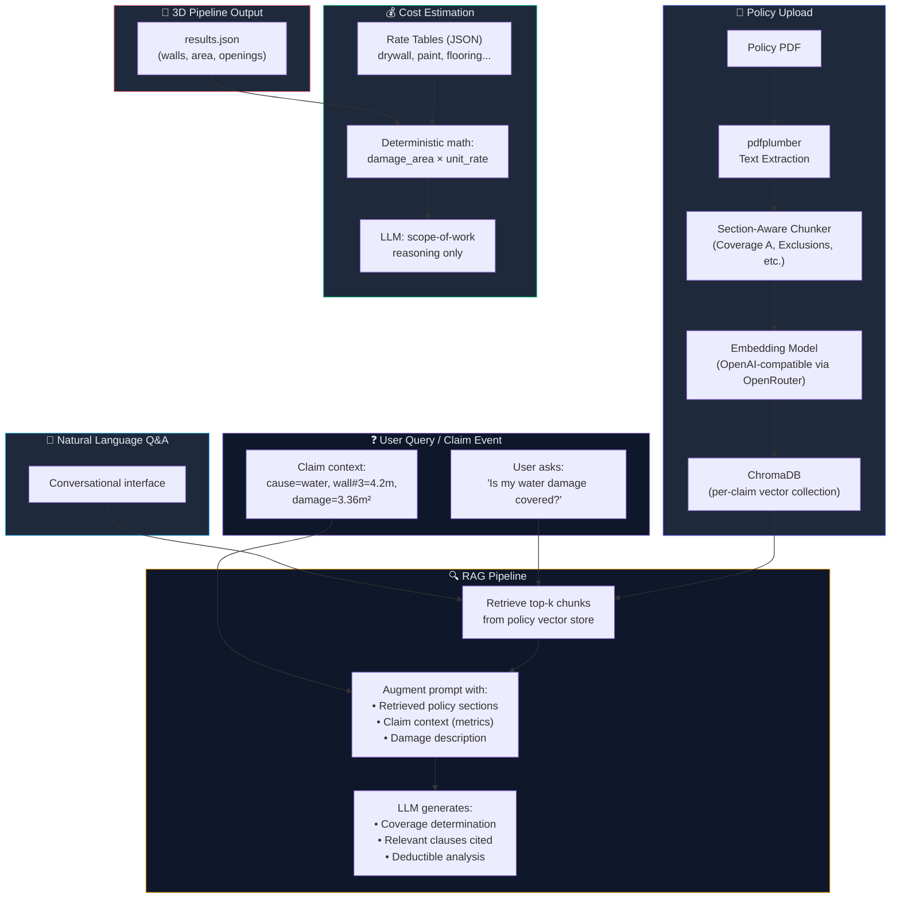

# Insurance Claim Agent Orchestration — Revised Plan

**Priority order**: Policy Interpretation (RAG) → Cost Estimation → Natural Language Q&A

---

## Why RAG for Policy Interpretation (and Why It's the Right Priority)

Insurance policies are the hardest part of filing a claim. A typical homeowner's policy (HO-3, HO-5) is 60–200 pages of dense legal language structured as:

```
Section I — Property Coverages
  ├── Coverage A — Dwelling           (what structure is covered, limits)
  ├── Coverage B — Other Structures   (detached garage, fence, shed)
  ├── Coverage C — Personal Property  (contents, sub-limits for jewelry etc.)
  └── Coverage D — Loss of Use        (temporary housing costs)

Section I — Perils Insured Against     (named perils vs open perils)
Section I — Exclusions                 (what is NOT covered — critical!)
Section I — Conditions                 (duties after loss, time limits)
Section II — Liability                 (not relevant for property claims)
Endorsements / Riders                  (modifications to base policy)
```

**Why RAG fits perfectly here:**
- You **cannot** stuff 200 pages into an LLM context window and ask a question — you'll hit token limits and the model will miss key exclusion clauses buried on page 147.
- Insurance questions are **retrieval problems**: *"Is gradual water damage covered?"* needs to find the specific exclusion clause in Section I, not read the entire liability section.
- Policy documents have **recurring structure** across insurers. Chunking by section/subsection works reliably.
- The LLM's job is **legal reasoning over retrieved chunks**, not memorization — this is where LLMs genuinely excel.

**What RAG does NOT replace:**
- The 3D pipeline's metric measurements (walls, area, openings)
- Deterministic cost math (area × rate = cost)

---

## Proposed Changes

### Architecture Overview



---

### Phase 1: Policy Language Interpretation (RAG)

This is the core value-add. A user uploads their insurance policy PDF, and the system can answer questions like:
- *"Is water damage from a burst pipe covered?"*
- *"What is my deductible for wind damage?"*
- *"Are there any exclusions for mold?"*
- *"What's the coverage limit for my dwelling?"*

---

#### [MODIFY] [config.py](file:///Users/aadarshkt/Desktop/3DReconstruction/backend/app/config.py)

Add LLM and RAG settings (the env vars already exist in `.env` but aren't wired into Python):

```python
# ── LLM / Agent ──────────────────────────────────────────────────────────
LLM_BASE_URL: str = "https://openrouter.ai/api/v1/"
LLM_API_KEY: str = ""
LLM_MODEL: str = "openrouter/free"
LLM_TIMEOUT_S: int = 120
LLM_MAX_TOKENS: int = 4096

# ── RAG / Embeddings ─────────────────────────────────────────────────────
EMBEDDING_MODEL: str = "text-embedding-3-small"  # via OpenRouter/OpenAI
CHROMA_PERSIST_DIR: str = "data/chromadb"         # vector store on disk
RAG_CHUNK_SIZE: int = 800           # tokens per chunk
RAG_CHUNK_OVERLAP: int = 100        # overlap between chunks
RAG_TOP_K: int = 6                  # chunks to retrieve per query
```

---

#### [NEW] `backend/app/agents/__init__.py`

Empty init for the agents package.

---

#### [NEW] `backend/app/agents/llm_client.py`

Thin synchronous wrapper around the OpenAI-compatible API:

- Uses `httpx` to call `LLM_BASE_URL/chat/completions`
- Supports both regular and JSON-mode responses
- Handles embeddings via `LLM_BASE_URL/embeddings`
- Retry with exponential backoff (3 attempts)
- Respects timeout and max_tokens from config
- Sync (for Celery tasks) — no async complexity needed

Key methods:
```python
class LLMClient:
    def chat(self, system: str, user: str, json_mode: bool = False) -> str: ...
    def embed(self, texts: list[str]) -> list[list[float]]: ...
```

---

#### [NEW] `backend/app/agents/policy_rag.py`

The core RAG engine for insurance policy documents. This is the most important new file.

**Ingestion pipeline** (`ingest_policy`):
1. **Extract text** from uploaded PDF using `pdfplumber` (handles multi-column layouts, tables, and headers common in insurance policies)
2. **Section-aware chunking**: Insurance policies have a predictable structure. The chunker:
   - Detects section headers (Coverage A, Exclusions, Conditions, etc.) via regex patterns matching standard policy forms
   - Splits within sections at paragraph boundaries, respecting `RAG_CHUNK_SIZE`
   - Each chunk gets metadata: `{section: "Exclusions", subsection: "Water Damage", page: 47, chunk_index: 3}`
   - This metadata is critical — it lets us boost retrieval of Exclusions when the user asks about coverage, and filter by section type
3. **Embed chunks** using the configured embedding model via `LLMClient.embed()`
4. **Store** in a ChromaDB collection named `policy_{claim_id}` with metadata

**Query pipeline** (`query_policy`):
1. **Embed the query** using the same embedding model
2. **Retrieve top-k** relevant chunks from ChromaDB, with optional metadata filtering (e.g., prioritize Exclusions + Perils sections when the question is about coverage)
3. **Augment** the LLM prompt with:
   - Retrieved policy chunks (with section labels and page numbers)
   - The claim context (property type, cause of loss, damage description, pipeline metrics)
4. **Generate** a structured response:
   ```python
   @dataclass
   class PolicyAnalysis:
       is_covered: bool | None         # True/False/None if ambiguous
       confidence: str                  # "high" | "medium" | "low"
       relevant_clauses: list[str]      # exact quotes from policy
       page_references: list[int]       # page numbers for verification
       exclusions_found: list[str]      # any applicable exclusions
       deductible: float | None         # extracted deductible amount
       coverage_limit: float | None     # extracted coverage limit
       reasoning: str                   # LLM's chain-of-thought explanation
       recommendations: list[str]       # next steps for the policyholder
   ```

**System prompt** for the policy analysis LLM call:
```
You are an insurance policy analyst. Given sections from an insurance policy 
and a claim description, determine:
1. Whether the described damage is covered under the policy
2. What specific clauses apply (quote them exactly)
3. Any exclusions that might deny the claim
4. The applicable deductible and coverage limits

IMPORTANT: 
- Always cite the exact policy language and page number
- If coverage is ambiguous, say so — do not guess
- Flag any "duties after loss" the policyholder must fulfill
- Distinguish between "named perils" and "open perils" policies
```

---

#### [NEW] `backend/app/models/claim.py`

SQLAlchemy model for claims:

```python
class ClaimStatus(str, enum.Enum):
    created           = "created"
    policy_uploading  = "policy_uploading"
    policy_indexed    = "policy_indexed"      # RAG ingestion complete
    analyzing_policy  = "analyzing_policy"
    estimating_costs  = "estimating_costs"
    complete          = "complete"
    failed            = "failed"

class Claim(Base):
    __tablename__ = "claims"

    id: str                       # UUID
    job_id: str                   # FK to Job (reconstruction results)
    status: ClaimStatus
    
    # Property & damage info
    property_type: str            # residential / commercial / industrial
    damage_description: str       # user's free-text description
    date_of_loss: str
    cause_of_loss: str            # fire / water / storm / vandalism / other
    
    # Policy info (optional — entered manually or extracted from PDF)
    policy_number: str | None
    insurer_name: str | None
    has_policy_pdf: bool          # whether a PDF was uploaded and indexed
    
    # Results (populated by agents)
    policy_analysis: dict | None  # JSONB — PolicyAnalysis from RAG
    cost_estimate: dict | None    # JSONB — itemized cost breakdown
    total_estimated_cost: float | None
    report_path: str | None       # path to generated claim report
    
    # Timestamps
    created_at: datetime
    updated_at: datetime
```

---

#### [NEW] `backend/app/api/claims.py`

REST API for the claim workflow:

| Endpoint | Method | Purpose |
|---|---|---|
| `/claims/create` | POST | Create a claim linked to a completed reconstruction job |
| `/claims/{id}` | GET | Get claim status and results |
| `/claims/{id}/policy/upload` | POST | Upload a policy PDF for RAG ingestion |
| `/claims/{id}/policy/query` | POST | Ask a question about the uploaded policy |
| `/claims/{id}/policy/analyze` | POST | Run full coverage analysis for this claim |
| `/claims/{id}/estimate` | POST | Generate cost estimate using pipeline metrics |
| `/claims/{id}/report` | GET | Download the generated claim report |
| `/claims/{id}/chat` | POST | Natural language Q&A (Phase 3) |

**`POST /claims/{id}/policy/query` request body:**
```json
{
  "question": "Is water damage from a burst pipe covered under my policy?"
}
```

**Response:**
```json
{
  "answer": "Yes, sudden and accidental discharge of water is covered under...",
  "is_covered": true,
  "confidence": "high",
  "relevant_clauses": [
    "Section I — Perils Insured Against, Item 13: 'Accidental discharge or overflow of water...'"
  ],
  "page_references": [34, 35],
  "exclusions_found": [],
  "reasoning": "The policy uses open-peril language for Coverage A (dwelling)..."
}
```

---

#### [MODIFY] [main.py](file:///Users/aadarshkt/Desktop/3DReconstruction/backend/app/main.py)

- Import and register the claims router: `app.include_router(claims_router.router, prefix="/claims", tags=["Claims"])`

#### [MODIFY] [celery_tasks.py](file:///Users/aadarshkt/Desktop/3DReconstruction/backend/app/tasks/celery_tasks.py)

- Add task: `ingest_policy_pdf(claim_id: str)` — runs the RAG ingestion pipeline in the background
- Add task: `run_claim_analysis(claim_id: str)` — runs full policy analysis + cost estimation
- Both publish progress via Redis pub/sub on channel `claim:{claim_id}:progress`

---

### Phase 2: Cost Estimation

This is deliberately **not LLM-heavy**. The 3D pipeline gives us exact metric dimensions. Cost estimation is mostly deterministic math with the LLM used only for scope-of-work reasoning.

#### [NEW] `backend/app/agents/cost_engine.py`

**Rate table** (embedded JSON, no external API dependency):
```python
# Residential repair rates (USD per unit, national average)
# Source structure — can be replaced with a real cost DB later
RATE_TABLE = {
    "drywall_repair": {"unit": "m2", "material": 12, "labor": 25, "total": 37},
    "drywall_replace": {"unit": "m2", "material": 18, "labor": 35, "total": 53},
    "interior_paint": {"unit": "m2", "material": 5, "labor": 15, "total": 20},
    "ceiling_repair": {"unit": "m2", "material": 20, "labor": 40, "total": 60},
    "flooring_hardwood": {"unit": "m2", "material": 45, "labor": 30, "total": 75},
    "flooring_tile": {"unit": "m2", "material": 35, "labor": 40, "total": 75},
    "flooring_carpet": {"unit": "m2", "material": 20, "labor": 15, "total": 35},
    "window_replace": {"unit": "each", "material": 350, "labor": 200, "total": 550},
    "door_replace": {"unit": "each", "material": 250, "labor": 150, "total": 400},
    "baseboard_replace": {"unit": "m", "material": 8, "labor": 12, "total": 20},
    "plumbing_repair": {"unit": "each", "material": 100, "labor": 200, "total": 300},
    "electrical_repair": {"unit": "each", "material": 80, "labor": 150, "total": 230},
    "roof_shingle": {"unit": "m2", "material": 30, "labor": 45, "total": 75},
    "insulation": {"unit": "m2", "material": 15, "labor": 20, "total": 35},
}
```

**Estimation flow:**
1. **LLM scoping step** (the only LLM call): Given the damage description + pipeline metrics (`results.json`), the LLM produces a structured list of **repair line items**:
   ```json
   [
     {"item": "drywall_replace", "quantity": 3.36, "unit": "m2", "notes": "North wall water damage"},
     {"item": "interior_paint", "quantity": 10.5, "unit": "m2", "notes": "Full wall repaint"},
     {"item": "baseboard_replace", "quantity": 4.2, "unit": "m", "notes": "Swollen from water"}
   ]
   ```
   The LLM's job is purely **deciding what needs repair** — it maps natural language damage descriptions to items from the rate table. It does NOT calculate costs.

2. **Deterministic cost math** (no LLM): Multiply each line item's quantity by the rate table entry:
   ```
   drywall_replace:  3.36 m² × $53/m² = $178.08
   interior_paint:  10.50 m² × $20/m² = $210.00
   baseboard_replace: 4.2 m  × $20/m  =  $84.00
   ──────────────────────────────────────────────
   Subtotal:                             $472.08
   ```

3. **Cross-reference with policy** (if Phase 1 is complete): Deductible of $1,000 → claim is below deductible → system advises user this claim may not be worth filing.

Output: `CostEstimate` dataclass stored in `claim.cost_estimate` JSONB.

---

### Phase 3: Natural Language Q&A

A conversational interface that lets the user ask questions about their claim, referencing both the policy (via RAG) and the pipeline data (via `results.json`).

#### [NEW] `backend/app/agents/claim_chat.py`

**How it works:**
1. User asks a question (e.g., *"How much will it cost to fix the water-damaged wall?"*)
2. System classifies the query intent:
   - **Policy question** → Route to RAG pipeline (`policy_rag.query_policy`)
   - **Cost question** → Route to cost engine with pipeline metrics
   - **Geometry question** → Answer directly from `results.json` (no LLM needed: *"Wall 3 is 4.2m long"*)
   - **General claim question** → LLM with full claim context
3. Response includes source attribution (policy page #, pipeline measurement, or rate table)

**Intent classification** is a lightweight LLM call with a constrained output:
```python
CLASSIFY_PROMPT = """Classify this question into one category:
- POLICY: about insurance coverage, exclusions, deductibles, policy terms
- COST: about repair costs, estimates, pricing
- GEOMETRY: about room dimensions, wall lengths, area, doors, windows
- GENERAL: general claim advice, next steps, process questions

Question: {question}
Category:"""
```

#### [MODIFY] Web Dashboard

##### [MODIFY] [index.html](file:///Users/aadarshkt/Desktop/3DReconstruction/web_dashboard/index.html)
- Add a third tab: **"Insurance Claim"**
- Sidebar gets a claim panel with:
  - Policy PDF upload dropzone
  - Damage description textarea
  - Property type / cause of loss dropdowns
  - "Analyze Coverage" button
  - "Estimate Costs" button
  - Chat input for natural language Q&A
- Main viewer area shows:
  - Policy analysis results (coverage determination, cited clauses)
  - Cost estimate table
  - Chat messages

##### [MODIFY] [viewer.js](file:///Users/aadarshkt/Desktop/3DReconstruction/web_dashboard/viewer.js)
- Policy PDF upload handler (multipart POST to `/claims/{id}/policy/upload`)
- Policy query submission
- Cost estimate rendering (itemized table)
- Chat interface with message history

##### [MODIFY] [style.css](file:///Users/aadarshkt/Desktop/3DReconstruction/web_dashboard/style.css)
- Claim tab styles, chat bubble styles, cost table styles, file upload dropzone

---

### Supporting Changes

#### [MODIFY] [requirements.txt](file:///Users/aadarshkt/Desktop/3DReconstruction/backend/requirements.txt)

```
# ── LLM / RAG ─────────────────────────────────────────────────────────────
httpx>=0.27.0                     # HTTP client for LLM API calls
pdfplumber>=0.11.0                # PDF text extraction (better than PyPDF2 for tables/columns)
chromadb>=0.5.0                   # Vector store for policy RAG
tiktoken>=0.7.0                   # Token counting for chunk sizing
```

#### [MODIFY] [docker-compose.yml](file:///Users/aadarshkt/Desktop/3DReconstruction/backend/docker-compose.yml)
- Pass `LLM_*` and `EMBEDDING_*` env vars through to `api` and `worker` containers
- Add `CHROMA_PERSIST_DIR` volume mount to persist the vector store

#### [NEW] `backend/alembic/versions/xxx_add_claims_table.py`
- Migration to create the `claims` table

#### [NEW] `backend/app/agents/prompts.py`
- All LLM system prompts and prompt templates centralized in one file for easy iteration:
  - `POLICY_ANALYSIS_SYSTEM_PROMPT`
  - `COST_SCOPING_SYSTEM_PROMPT`
  - `CHAT_CLASSIFY_PROMPT`
  - `CHAT_RESPONSE_SYSTEM_PROMPT`

---

## File Structure After Implementation

```
backend/app/
├── agents/
│   ├── __init__.py
│   ├── llm_client.py        # OpenAI-compatible API wrapper
│   ├── policy_rag.py         # PDF ingestion + chunking + ChromaDB + retrieval
│   ├── cost_engine.py        # Rate tables + deterministic cost math
│   ├── claim_chat.py         # NL Q&A with intent routing
│   └── prompts.py            # All LLM prompt templates
├── api/
│   ├── claims.py             # Claim REST endpoints (NEW)
│   ├── jobs.py               # (existing, unchanged)
│   ├── uploads.py            # (existing, unchanged)
│   └── results.py            # (existing, unchanged)
├── models/
│   ├── claim.py              # Claim SQLAlchemy model (NEW)
│   └── job.py                # (existing, unchanged)
├── pipeline/
│   └── ... (existing, unchanged)
├── tasks/
│   └── celery_tasks.py       # + ingest_policy_pdf, run_claim_analysis tasks
├── config.py                  # + LLM and RAG settings
└── main.py                    # + claims router registration
```

---

## Demo Workflow

```
1. 📱 User already has a completed reconstruction job (Job ID: abc-123)
      → results.json: 4 walls, 18.4 m², 2 doors, 1 window

2. 📋 User creates a claim:
      POST /claims/create { job_id: "abc-123", cause: "water", 
                            damage: "Burst pipe caused water damage to kitchen north wall" }

3. 📄 User uploads their State Farm HO-3 policy PDF:
      POST /claims/{id}/policy/upload  (multipart PDF)
      → Background: pdfplumber extracts text → section-aware chunking → 
        embedding → stored in ChromaDB  (takes ~10-30 seconds)

4. 🔍 User asks: "Is my water damage covered?"
      POST /claims/{id}/policy/query { question: "Is water damage covered?" }
      → RAG retrieves: Section I Perils #13 (accidental discharge), 
        Section I Exclusions #3 (continuous seepage)
      → LLM: "Covered if the pipe burst was sudden. If it's been leaking 
              slowly, Exclusion 3(c) applies. See pages 34, 47."

5. 💰 User requests cost estimate:
      POST /claims/{id}/estimate
      → LLM scoping: 3 line items (drywall replace, paint, baseboard)
      → Deterministic math: $472.08 total
      → Policy cross-ref: Below $1,000 deductible → may not be worth filing

6. 💬 User asks follow-up: "What if the ceiling is damaged too?"
      POST /claims/{id}/chat { message: "What if ceiling is also damaged?" }
      → Adds ceiling repair line item (room_area from pipeline = 18.4 m²,
        estimate affected area ~4 m²)
      → Updated total: $712.08 → still below deductible

7. 📦 User downloads claim report (if they decide to file):
      GET /claims/{id}/report
      → Markdown report with policy citations, itemized costs, floor plan, measurements
```

---

## Verification Plan

### Automated Tests
```bash
# Test PDF ingestion + chunking
pytest backend/tests/test_policy_rag.py -v

# Test cost engine with mock pipeline data
pytest backend/tests/test_cost_engine.py -v

# Test claim API endpoints
pytest backend/tests/test_claims_api.py -v

# Integration: upload PDF → query → verify retrieval quality
pytest backend/tests/test_rag_integration.py -v
```

### Manual Verification
1. Start backend: `./run.sh start -d`
2. Upload a sample HO-3 policy PDF (publicly available from state insurance commission websites)
3. Ask 5 standard coverage questions, verify answers cite correct policy sections
4. Create a claim with pipeline results, verify cost estimate uses correct wall dimensions
5. Test the chat interface with follow-up questions
6. Generate and review the claim report

---

## Open Questions

> [!IMPORTANT]
> **Embedding Model**: The `.env` uses OpenRouter. OpenRouter proxies various models — do you have a preference for the embedding model? `text-embedding-3-small` (OpenAI) is cheap and good. Alternatively, we can use a local model via `sentence-transformers` to avoid API costs, but it adds ~500MB to the Docker image.

> [!IMPORTANT]
> **Sample Policy PDF**: For testing, we'll need a real or realistic insurance policy PDF. Several state insurance commissions publish sample HO-3 forms publicly. Should I find and include one in the test fixtures?

> [!NOTE]
> **ChromaDB vs PostgreSQL pgvector**: ChromaDB is simpler to set up (file-based, no extra service). If you later want to scale or query across many policies, we could migrate to `pgvector` since you already run PostgreSQL. For now ChromaDB keeps things simple.
