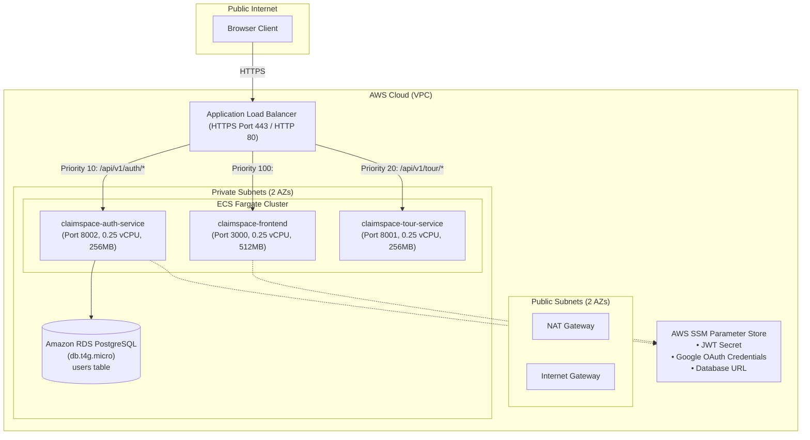

# Lightweight AWS Deployment Architecture

This architecture outlines the standalone, cost-optimized deployment of **ClaimSpace** on AWS ECS Fargate, routing traffic via an Application Load Balancer (ALB) directly to the decoupled microservices.

